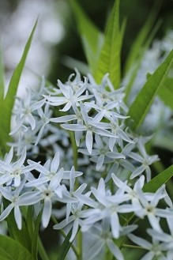

# kmeansPoto

使用k-means聚类获得图片主要颜色

# DEMO

原图:

聚类得到的:

# Source

看了@[novoselrok]的项目[color-palette-wasm]之后，觉得很有意思但是我这里调不通

所以就拿py又写了一次……

# Attention
<strong>贼慢</strong>

图片要压到比较小，要不然跑起来真是要了命

# Usage

到时候再写成可被调用形式吧……

[novoselrok]:https://github.com/novoselrok
[color-palette-wasm]:https://github.com/novoselrok/color-palette-wasm
